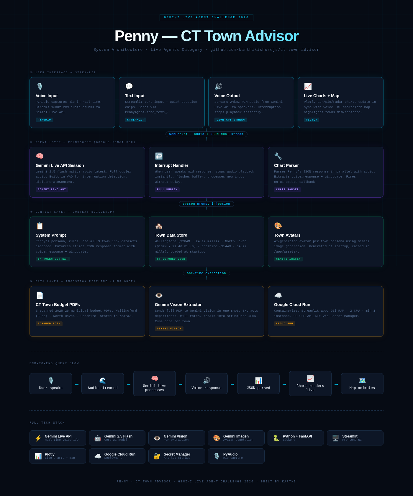

# 🏠 Penny - CT Town Advisor

A voice-enabled AI advisor for Connecticut towns, built with **Gemini Live API**, **Streamlit**, **FastAPI**, and **Plotly**. Penny helps residents decide where to live in CT by explaining town budgets, taxes, and services — by voice or text — with real-time charts, interactive maps, and tax calculators, all grounded in official budget documents.



---

## Features

- **Voice conversations** — Talk to Penny using your microphone; she responds in natural speech via Gemini's native audio model
- **Text chat** — Type questions and get instant structured responses with data citations
- **Live charts** — Bar, pie, and radar charts auto-generated when comparing towns
- **Interactive map** — CT towns plotted on a dark-themed Mapbox map with dynamic highlighting
- **Tax calculator** — Slider-based property tax estimator using real mill rates (CT 70% assessment)
- **Zillow listings** — Clickable cards linking to home listings for each town
- **Persona cards** — Each town has a unique AI-generated avatar and personality profile
- **Quick questions** — One-click starter chips with voice playback via Gemini TTS

---

## Architecture

```
User (voice / text)
       │
       ▼
  ┌─────────────────────────────────────┐
  │   Streamlit Frontend (app/main.py)  │
  │   • Text input / Quick questions    │
  │   • Chart rendering (Plotly)        │
  │   • Persona cards / Tax calculator  │
  │   • Audio playback (Gemini TTS)     │
  └──────────┬────────────┬─────────────┘
             │            │
     Text queries    Voice (Cloud Run)
             │            │
             ▼            ▼
  ┌──────────────┐  ┌──────────────────────────┐
  │  Gemini API  │  │  FastAPI WebSocket Proxy  │
  │  generate_   │  │  (api/main.py)            │
  │  content     │  │  Browser ↔ Gemini Live    │
  │  (sync JSON) │  │  PCM 16kHz → 24kHz        │
  └──────────────┘  └──────────────────────────┘
                              │
                              ▼
                    ┌─────────────────────┐
                    │  Gemini Live API    │
                    │  native-audio model │
                    │  (bidirectional)    │
                    └─────────────────────┘
```

### Data Flow

**Text queries** → `generate_content` (synchronous) → JSON response with `voice_response` + `ui_update` → Charts, persona, calculator rendered in Streamlit

**Voice queries** → Browser WebSocket → FastAPI proxy → Gemini Live API → PCM audio + transcript back to browser → UI extraction via follow-up `generate_content` call

---

## Quickstart

### 1. Clone & set up environment

```bash
git clone <repo-url>
cd ct-town-advisor

python -m venv .venv
source .venv/bin/activate       # Windows: .venv\Scripts\activate
pip install -r requirements.txt
```

### 2. Configure credentials

```bash
cp .env.example .env
# Edit .env and add your GOOGLE_API_KEY
```

### 3. Run locally (full stack)

```bash
chmod +x infra/dev.sh
./infra/dev.sh
```

This starts:
- **Streamlit** on port 8501
- **FastAPI** (uvicorn) on port 8081
- **nginx** on port 3000 (reverse proxy)

Open [http://localhost:3000](http://localhost:3000) in your browser.

### 4. Run Streamlit only (text mode)

```bash
streamlit run app/main.py
```

Open [http://localhost:8501](http://localhost:8501). Voice features require the full stack.

---

## Project Structure

```
ct-town-advisor/
├── app/
│   ├── main.py                    # Streamlit UI — text + voice modes
│   ├── assets/                    # Town avatar images (PNG)
│   └── components/
│       └── audio_component/
│           └── index.html         # Browser WebSocket audio client
│
├── api/
│   └── main.py                    # FastAPI WebSocket proxy (Gemini Live)
│
├── src/
│   ├── context_builder.py         # System prompt builder + town data
│   ├── gemini_client.py           # Live API session wrapper
│   ├── live_agent.py              # Full-duplex voice agent (PyAudio)
│   ├── chart_parser.py            # Parse chart JSON from responses
│   ├── chart_builder.py           # Plotly chart validation + CT theme
│   ├── audio_utils.py             # PCM ↔ WAV conversion helpers
│   ├── pdf_loader.py              # PDF loading (legacy + GCS)
│   ├── extract_town_data.py       # One-shot PDF → JSON extraction
│   ├── file_api.py                # Gemini File API caching
│   ├── gcs_loader.py              # Google Cloud Storage sync
│   └── generate_avatars.py        # Avatar generation (Imagen)
│
├── data/
│   ├── json/                      # Structured town data
│   │   ├── cheshire.json
│   │   ├── north_haven.json
│   │   └── wallingford.json
│   └── pdf/                       # Raw budget documents
│
├── tests/
│   ├── conftest.py                # Shared test fixtures
│   ├── test_chart_parser.py       # Chart JSON parsing tests
│   ├── test_chart_builder.py      # Plotly validation + theming tests
│   ├── test_context_builder.py    # System prompt + town data tests
│   ├── test_audio_utils.py        # PCM/WAV conversion tests
│   └── test_app_logic.py          # UI update, tax calc, chart gen tests
│
├── infra/
│   ├── Dockerfile                 # Multi-stage Python 3.11 build
│   ├── dev.sh                     # Local dev stack launcher
│   ├── deploy.sh                  # Cloud Run deployment script
│   ├── start.sh                   # Container entrypoint
│   ├── nginx.conf                 # Production reverse proxy
│   ├── cloudrun.yaml              # Cloud Run service spec
│   ├── cloudbuild.yaml            # Cloud Build config
│   └── setup_secrets.sh           # Secret Manager setup
│
├── docker-compose.yml
├── requirements.txt
├── .env.example
└── README.md
```

---

## Gemini Models

| Purpose | Model | Method |
|---------|-------|--------|
| Text queries | `gemini-2.5-flash` | `generate_content` (sync) |
| Voice streaming | `gemini-2.5-flash-native-audio-latest` | Live API (bidirectional) |
| Text-to-speech | `gemini-2.5-flash-native-audio-latest` | Live API (`send_client_content`) |
| Avatar generation | `imagen-4.0-fast-generate-001` | `generate_images` |
| PDF extraction | `gemini-2.5-flash` | `generate_content` (one-shot) |

---

## Town Data

Penny knows about three Connecticut towns, each with a unique persona:

| Town | Persona | Budget | Mill Rate | Median Home | Population |
|------|---------|--------|-----------|-------------|------------|
| **Cheshire** | The Safe Haven | $144.4M | 34.0 | $390,000 | 29,000 |
| **North Haven** | The Balanced Town | $137.6M | 36.55 | $301,000 | 24,000 |
| **Wallingford** | The Education Champion | $204.1M | 24.12 | $277,618 | 45,000 |

Town data is stored as structured JSON in `data/json/` — extracted from official budget PDFs using Gemini.

---

## Key Design Decisions

| Decision | Rationale |
|----------|-----------|
| **JSON town data in system prompt** | All context embedded directly — no vector DB, no RAG pipeline needed |
| **Structured JSON responses** | Penny returns `{voice_response, ui_update}` — one call drives text, charts, calculator, and listings |
| **Gemini Live API for voice** | Full-duplex streaming with server-side VAD; handles interruptions natively |
| **WebSocket proxy (FastAPI)** | Browser can't connect directly to Gemini; proxy relays PCM frames |
| **Dual input paths** | Text (sync `generate_content`) and voice (async Live API) share the same response schema |
| **Gemini TTS for text queries** | Quick questions spoken in Penny's Gemini voice (not browser's `speechSynthesis`) |
| **Voice → UI extraction** | Follow-up `generate_content` call converts voice transcript to chart/calculator/listing updates |
| **CT 70% assessment ratio** | Tax calculator uses Connecticut's statutory assessment ratio for accurate estimates |

---

## Voice Pipeline

The voice system uses a two-phase approach:

1. **Recording** — Browser captures mic audio, downsamples Float32@48kHz → Int16@16kHz, sends binary frames over WebSocket
2. **Proxying** — FastAPI receives PCM frames, forwards to Gemini Live API session
3. **Response** — Gemini returns Int16@24kHz audio chunks + transcript; proxy streams both to browser
4. **Stop flow** — When user clicks Stop, browser sends `{"type":"mic_stopped"}` text frame; server injects 1.5s silence to trigger Gemini's VAD, then streams response back while WebSocket stays open
5. **Cleanup** — After `turn_complete`, browser closes WebSocket cleanly

---

## Testing

### Run all tests

```bash
pytest tests/ -v
```

### Run a specific test file

```bash
pytest tests/test_chart_parser.py -v
pytest tests/test_context_builder.py -v
```

### Test coverage areas

- **Chart parsing** — Valid/malformed JSON extraction from Gemini responses
- **Chart building** — Plotly validation, CT theme application
- **Context builder** — System prompt generation, town data loading, accessors
- **Audio utilities** — PCM ↔ WAV conversion, chunking
- **App logic** — UI update application, tax calculations, chart generation

---

## Deploy to Cloud Run

### Prerequisites

- [gcloud CLI](https://cloud.google.com/sdk/docs/install) installed and authenticated
- A Google Cloud project with billing enabled
- `GOOGLE_CLOUD_PROJECT` and `GOOGLE_API_KEY` in your `.env`

### One-time setup

```bash
chmod +x infra/setup_secrets.sh infra/deploy.sh
./infra/setup_secrets.sh
```

### Deploy

```bash
./infra/deploy.sh
```

### What gets provisioned

| Resource | Details |
|----------|---------|
| Cloud Run service | `ct-town-advisor` · `us-central1` · 2 vCPU / 2 GiB |
| Scaling | min 1 · max 3 instances |
| Secret | `GOOGLE_API_KEY` via Secret Manager |
| Auth | Public (unauthenticated) |
| Proxy | nginx on :8080 → Streamlit :8501 + FastAPI :8081 |

---

## Docker (local)

```bash
docker compose -f docker-compose.yml up --build
```

---

## Environment Variables

| Variable | Required | Description |
|----------|----------|-------------|
| `GOOGLE_API_KEY` | Yes | Gemini API key from Google AI Studio |
| `GOOGLE_CLOUD_PROJECT` | No | GCP project ID (for Cloud Run deploy) |
| `GCS_BUCKET_NAME` | No | GCS bucket with PDFs at `pdfs/` prefix |
| `GEMINI_MODEL` | No | Override Live API model name |
| `GEMINI_TEXT_MODEL` | No | Override text model (default: `gemini-2.5-flash`) |
| `K_SERVICE` | Auto | Set by Cloud Run; disables PyAudio mic |

---

## Dependencies

| Category | Packages |
|----------|----------|
| **AI/ML** | `google-genai>=0.8.0`, `google-cloud-storage>=2.16.0` |
| **Frontend** | `streamlit>=1.36.0`, `plotly>=5.22.0` |
| **Backend** | `fastapi>=0.111.0`, `uvicorn[standard]>=0.30.0` |
| **Audio** | `pyaudio>=0.2.11` |
| **Utilities** | `pymupdf>=1.24.0`, `python-dotenv>=1.0.0` |
